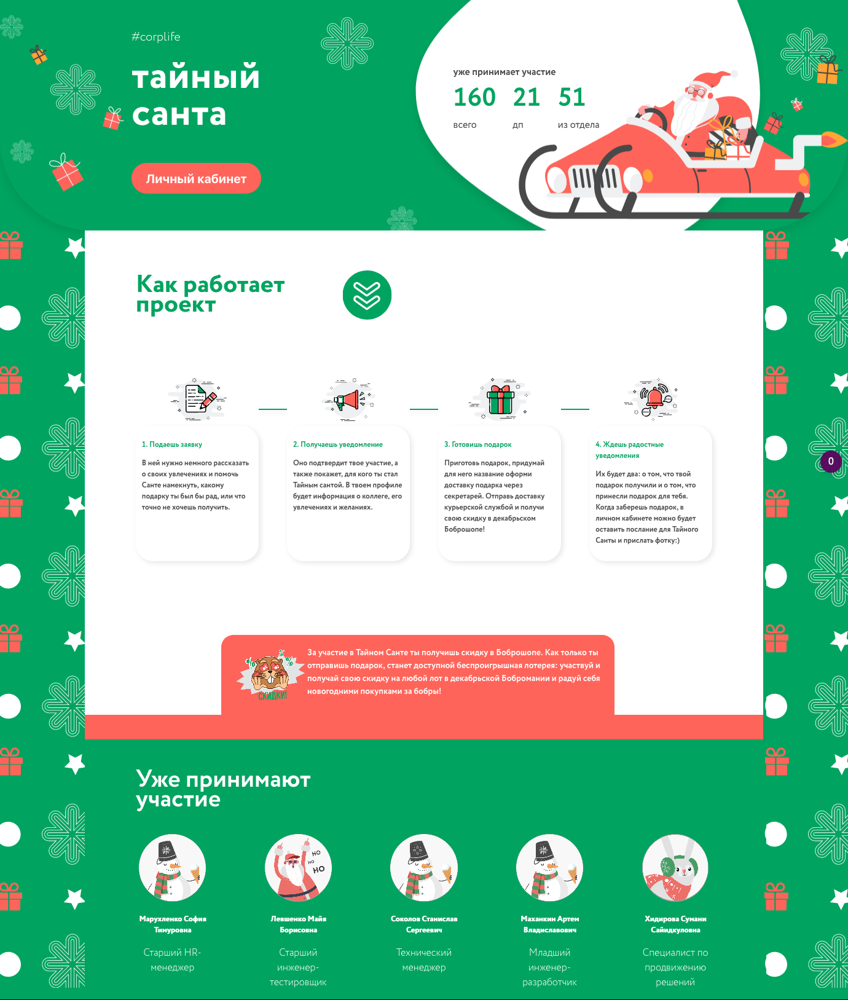
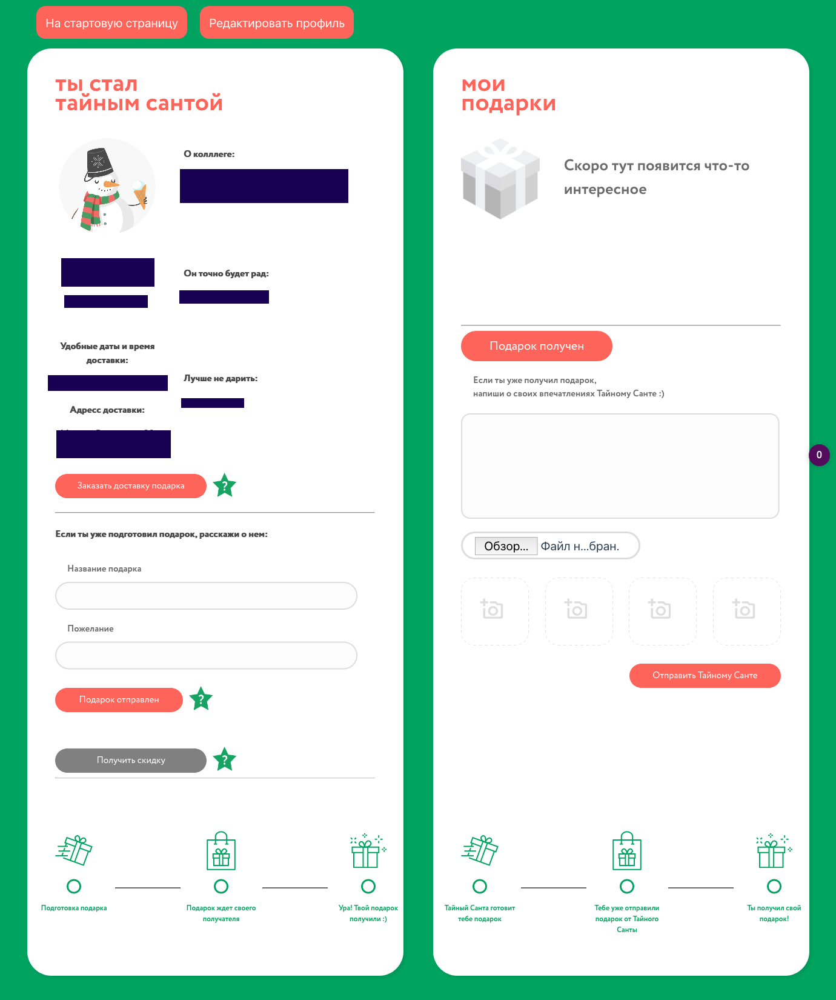

# SecretSanta

> Проект созданный на Vue, для сroc

`Проект не работает без` [сервера](https://github.com/nik19ta/Secret-Santa-Server)

## Установить все необходимые пакеты 
```sh
npm install # или: yarn
```

### Для того что бы запустить проект для разработки

```sh
npm run serve # или: yarn serve
```

### Для того что бы сбилдить проект нужно:
```sh
npm run build # или: yarn build
```

## Скриншоты:


- Вся страница:

- Вход

- Профиль

- Настройки профиля
